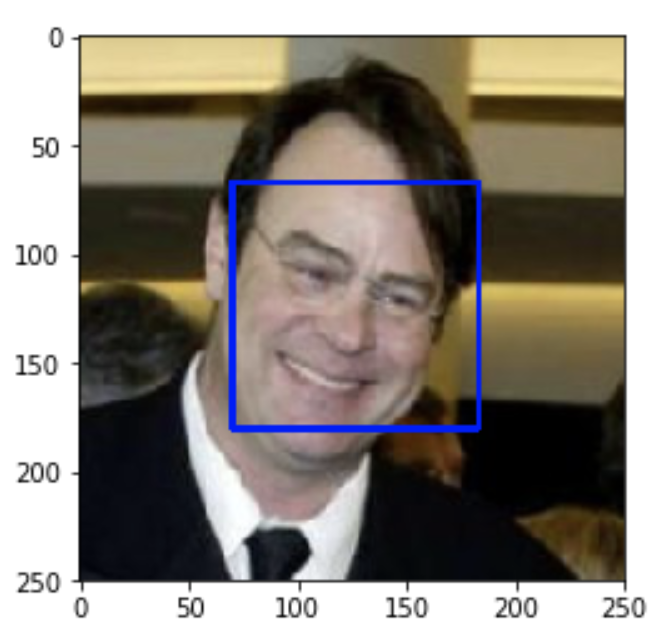
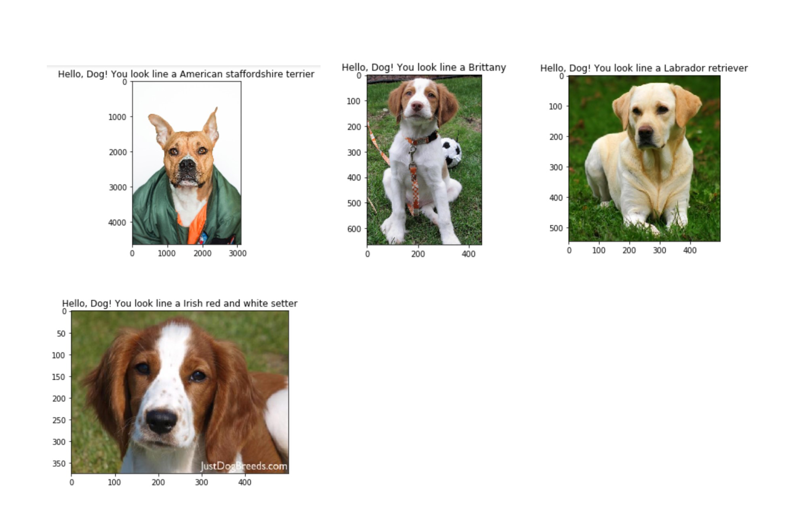
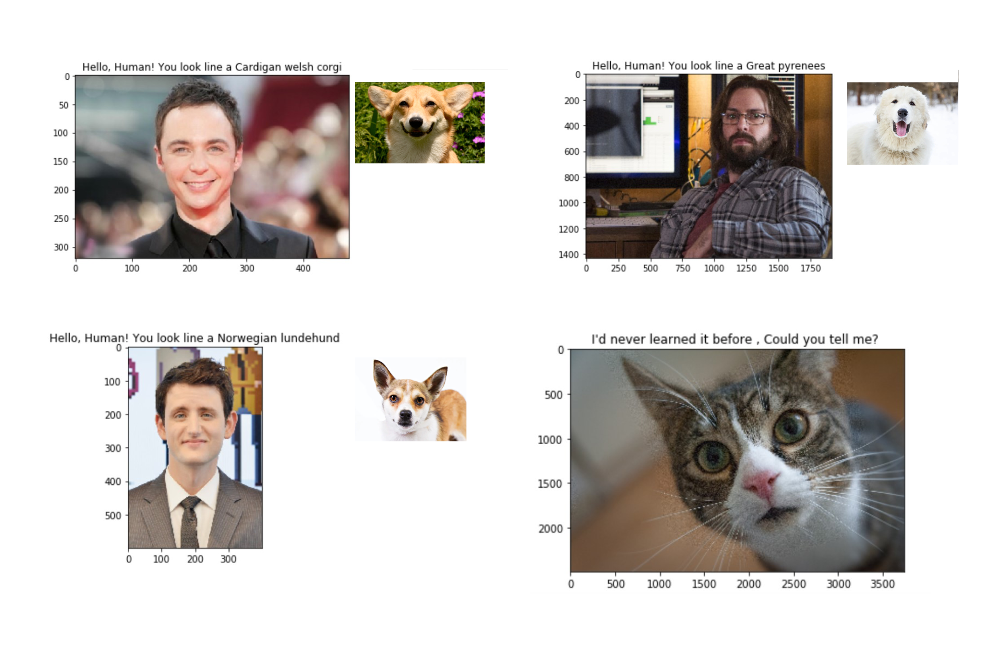

# Dog Breed Classifier (Pytorch)

  It's the Convolutional Neural Networks (CNN) project! In this project, built a pipeline to process real-world, user-supplied images. Given an image of a dog, The algorithm will identify an estimate of the canine’s breed. If supplied an image of a human, the code will identify the resembling dog breed.

## Running APP

### Detect Humans face

Utilize OpenCV's implementation of [Haar feature-based cascade classifiers](http://docs.opencv.org/trunk/d7/d8b/tutorial_py_face_detection.html) to detect human faces in images.  

OpenCV provides many pre-trained face detectors, stored as XML files on [github](https://github.com/opencv/opencv/tree/master/data/haarcascades). 

### Classify Dog Breeds
Utilize transfer learning to create CNN, reference [ResNet](https://arxiv.org/pdf/1512.03385.pdf).
* if a dog is detected in the image, return the predicted breed.

* if a human is detected in the image, return the resembling dog breed.
if neither is detected in the image, provide output that indicates an error.

## Datasets
* Download the [dog dataset](https://s3-us-west-1.amazonaws.com/udacity-aind/dog-project/dogImages.zip).  Unzip the folder and place it in this project's home directory, at the location `data/dogImages`. 

* Download the [human dataset](https://s3-us-west-1.amazonaws.com/udacity-aind/dog-project/lfw.zip).  Unzip the folder and place it in the home directory, at location `data/lfw`. 

## Prerequisites

* conda    4.7.12
* pytorch  1.3.0                
* python   3.7.5

## Versioning

We use [SemVer](http://semver.org/) for versioning. For the versions available, see the [tags on this repository](https://github.com/your/project/tags).

## Built With

* [Pytorch](https://pytorch.org/) - An open source machine learning framework that accelerates the path from research prototyping to production deployment.

## Authors

* **Tom** - *Fullstack egineer* - [github profile](https://github.com/tomgtqq)

## License

This project is licensed under the MIT License
